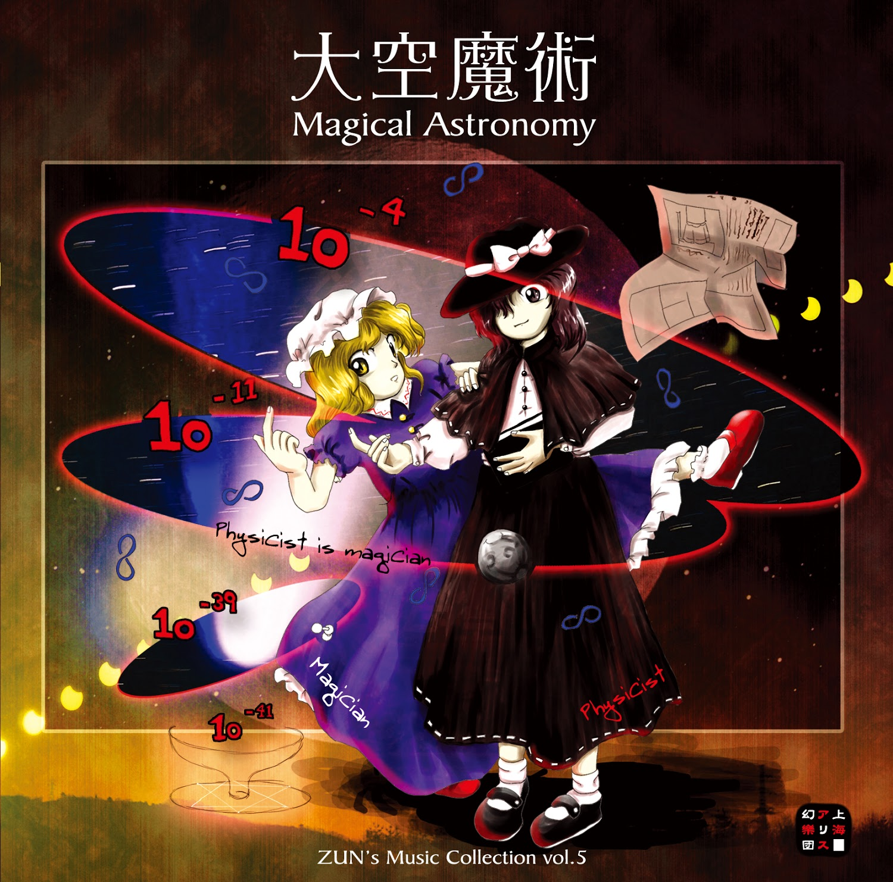

# Magical Astronomy / Astronomia Mágica (Tradução)

## História

**Romance eterno, uma cadeira de rodas espacial.**

**…Qual é o maior problema entre a Viagem Lunar privada e a física?**

### ***Bem-vindo à Viagem Lunar***

***“Bem-vindo à Cidade Lunática.”***

> Realizando um dos sonhos da humanidade, as viagens lunares são finalmente possíveis para todos!

> Viagens de cada uma das agências de viagens do Japão começarão no próximo mês.

O som de passos pesados de pessoas indo e vindo para a estação ferroviária martelava no ar, junto com extras de jornais voando em todas as direções.

Enquanto a maioria só tinha interesse na seção de esportes, desta vez, as notícias raramente boas que os extras tinham fizeram com que as pessoas os segurassem para guardá-los em suas malas. Alguns disseram que estavam interessados nos artigos, mas muitos ficaram cativados pelas fotos.

Imagens do universo acalmam a alma. O motivo é que elas te forçam a perceber a trivialidade da humanidade. Apesar de todas as dificuldades que enfrentamos, o sentimento que temos quando as comparamos com a imensidão do espaço nos conforta. Com um universo tão imenso, nossos próprios esforços não são muito importantes. Chefes, políticos e ditadores caídos são todos humanos insignificantes. Deve-se trabalhar para a sua própria satisfação. Isso pode ser sentido apenas olhando as imagens do universo.

**Renko Usami** e **Maribel Hearn** (Merry) estão animadamente conversando em um café na calçada do campus de sua universidade.

### ***Greenwich no Céu***

***“Observatório Real de Greenwich”***

> Dizem que agora também estão enviando outra sonda marciana tripulada.

> Sério? Mas isso não importa agora. O que eu quero falar agora são as “Viagens Lunares” que todos os jornais falaram.

> Sim, para alguém que pode dizer a exata hora e local apenas olhando para as estrelas e a Lua, você iria gostar de saber como é a superfície da Lua de perto, não é?

> Eu saberia que “Estou na lua”, não saberia?

> E quanto à hora?

> Tudo o que eu sei é o horário padrão japonês (JST). O tempo universal coordenado (UTC) está além das minhas habilidades. Seria estranho se a Terra e a Lua usassem o mesmo horário, de qualquer forma.

> Espera, espera. “Além das suas habilidades?” É só uma questão de subtração, não é?

> Eles usam UTC no espaço atualmente, mas é basicamente o mesmo que o Tempo Médio de Greenwich (TMG). O Observatório Real de Greenwich foi construído no século XVII. Quando você pensa em um sistema de horário feito para observar o universo para ser usado nesse universo, é algo um tanto engraçado.

### ***Noite sem Sono no País Oriental***

***“Vida Noturna Vampírica”***

> Então, quando vamos nessa essa Viagem Lunar?

> Você é muito apressada, Merry.  
Bem, mas eu gostaria de fazer as reservas logo, já que tenho certeza de que vai estar lotado.

> Provavelmente vai estar extremamente lotado durante as férias de verão e tal. Já que estará um pouco quente, que tal adiar para o outono?

> Não acho que a Lua fique muito quente, mas eu concordo.  
Outono é agradável, acho bem japonês.  
Nesse caso, vamos durante a Lua cheia.

> E vamos trazer bolinhos!  
Perfeito! É isso aí!

Mesmo com todo o conhecimento que temos sobre isso, não sentimos nada pelo universo além de um eterno romance.
Quanto a um desses romances, se pudéssemos ir e ficar em nossa atraente Lua, acho que todos estariam ansiosos para ir.

No entanto, essas duas ainda não sabiam o preço que tal viagem custaria.

### ***O Futuro da Cadeira de Rodas no Espaço***

***“História do Tempo”***

> Mas uma sonda marciana tripulada ainda tem que ser realizada com sucesso.  
Será que podemos testemunhar o universo imaginado por Hawking?

> Afinal, o problema é que não houve físicos que superaram Hawking.

> Ah, mas e você, Renko? Você só precisa trabalhar duro para isso.  
Você tem uma habilidade rara.

> Estou em uma diferente área, mas talvez eu seja tão inteligente quanto Planck. Além disso, acho que não é praticamente possível observar a dissipação de um buraco negro.  
Não acho nem que a humanidade chegará à Marte.

> Ah, que pessimista. Mas se é isso que você acha, vou acreditar em você.

> A quantidade de energia necessária para observar isso é enorme. Na verdade, a física observacional prática, muito menos teórica, está chegando ao fim.  
E enquanto eu penso nisso, a Viagem Lunar é muito cara.

A física está chegando ao fim. Nosso mundo já estava progredindo rapidamente em uma era de explicações e filosofia.

### ***Desmistificar Festa***

“***Além do Véu de Mistério”***

> Sim, mesmo estando no campus, esse café está bastante na moda e a comida é boa também.  
Então, por que a física está chegando ao fim, Renko?

> Para ser breve, o custo da observação é muito caro.

> O mesmo motivo pelo qual não podemos ir à Viagem Lunar, certo?

> A energia necessária para separar objetos pequenos se torna maior à medida que os objetos se tornam menores. Da molécula ao átomo, do núcleo ao quark. Se estes se tornassem menores, precisaríamos de uma quantidade inesgotável de energia para separá-los, certo? E então quando finalmente chegarmos ao ponto em que encontramos um objeto que não pode ser separado mesmo que utilizássemos toda a energia do universo, podemos dizer que este objeto é a menor substância do mundo.  
A física está passando para a próxima fase porque já alcançou o menor mundo. Não podemos mais observar, então agora é principalmente o reino da filosofia.

> Ah, esse novo bolo parece ser delicioso!  
Suas menores unidades seriam ovo artificial e morango artificial, certo?

Diz-se que a quantidade de energia é limitada a 10^19 GeV. Se uma quantidade de energia exagerasse essa quantidade, ela não poderia existir no espaço-tempo. Aliás, esse 10^19 GeV é chamado de energia de Planck, que é cerca de 10^21 vezes maior que a energia criada pela energia nuclear.

### ***Terraço do Café Satélite***

***“Café Satélite”***

> Caramba, eu sempre me esqueço de não discutir física com você, Renko.  
Sempre vira uma conversa desbalanceada.

> É, é, foi mal. É apenas a minha especialidade.  
Mas esse bolo é muito bom.

> Eu queria que pudéssemos ir para a Lua…  
Mas, naturalmente, isso custa uma fortuna.

> Isso me lembrou de uma coisa. Você sabia que eles abriram uma cafeteria em um satélite para os viajantes espaciais? Dizem que o café feito em gravidade zero é fenomenal.

> Mas tem que ser uma cafeteria interna, não é?  
Prefiro os ao ar livre, como os terraços.

Quando o café é exposto ao vácuo, mesmo que por um momento, ele ferve instantaneamente devido à baixa pressão, mas a água congela assim que o calor se dissipa.
Esse café fervido, mas gelado, o Café Satélite Gelado, é a principal atração do cardápio.

### ***G Livre***

***“Gravidade Zero”***

> Agora que você mencionou, o café não precisa de gravidade para ser preparado?  
As gotas não vão cair sem ela.  
Como eles fazem café sob gravidade zero?

> É por isso que trouxeram as cafeteiras a vácuo de volta dos mortos.  
Ela circula água quente com pressão de vapor.

> Cafeteiras a vácuo…  
Só vi cafeteiras a vácuo como decorações em cafeterias, mas suponho que também sejam usadas para fazer café.  
Mesmo assim, ouvi dizer que o café coado é mais gostoso…

> São cafeteiras modificadas para gravidade zero. Como não há convecção, eles podem fazer um café com um rico sabor.

> Hum… se não fosse o café, eu estaria bem acordada no espaço.  
Pela emoção…

A humanidade, libertada da gravidade, está desenvolvendo uma nova cultura. Mas, ao mesmo tempo, descobriram que muitas de suas ferramentas dependiam da gravidade para funcionar.  
Foi recentemente que a força gravitacional, comprovada há muito tempo e por muito tempo atormentou os físicos, unificou-se com as outras forças.

### ***Feitiçaria Celestial ~ Astronomia Mágica***

> Uau, o universo é mesmo fascinante…

> O que foi agora? Está dizendo que não há nada de fascinante na Terra?

> Às 16h31, vi a estrela vespertina. É que quase não sobraram mistérios na Terra.

> Se eu pudesse ver todos os mecanismos desse mundo igual você, Renko, acho que iria me tornar niilista.

> É por isso que eu invejo seus olhos, Merry.  
Você pode ver muitos mundos misteriosos.  
Além disso, eu queria que você vesse a lacuna na fronteira da Lua.

> Eu faria isso se não fosse tão caro.

A fronteira não faz parte da Terra; é só uma borda, então é comum que a Lua também tenha uma.  
A fronteira da Lua é aquela que separa a deslumbrante Capital Lunar do satélite desolado e sem vida. Enquanto a fronteira existir, mesmo que você vá para a Lua, você não poderá ter nenhum dos bolos de arroz ou remédios que os coelhos lunares estão fazendo; no máximo, uma pedra da Lua.

> A Lua pode estar escondendo um mundo esquecido; uma capital lunar com uma civilização avançada onde vivem os nobres.  
Os coelhos fariam medicina da imortalidade enquanto contemplavam o corvo de três patas que vivia ao sol e se preocupava com a humanidade, animados com a Viagem Lunar.  
Você é a única que pode ver esse mundo, Merry.

> Você está certa. Eu quero ir antes que os humanos se reúnam e colonizem tudo.

> Então se está decidido, vamos começar a nos preparar.

> Se quisermos ver a Capital Lunar, talvez devêssemos aprender mais sobre ela.  
Sobre a antiga Lua que foi esquecida por muito tempo.  
Sobre a deslumbrante capital lunar da lenda.  
Sobre a Lua que simboliza a insanidade.  
Sim, o conhecimento ajudará a discernir a lacuna na fronteira.

> Espere, na minha opinião, o que temos que focar primeiro é conseguir um emprego de meio período, para que possamos ganhar dinheiro suficiente para ir para lá.

### ***Necrofantasia***

Embora o sol tenha se posto e a hora do jantar estivesse se aproximando, elas finalmente deixaram o café depois de comer o novo bolo.

Nessa universidade, os estudantes podem pagar com um cartão de estudante em qualquer uma das lojas do campus. O preço é cobrado junto com a mensalidade.

Ele reduz a necessidade de administrar dinheiro, evita registros lotados e permite que os estudantes façam compras facilmente (porque seus pais pagam pela mensalidade), aumentando as vendas como resultado. Mas, graças a isso, os estudantes agora encontram suas despesas acumulando muito mais do que o esperado.

> Há um elixir da imortalidade na Lua, supostamente.

> *Imortalidade*, hein?  
Mas não parece que alguém como você precisaria dela, não é Renko? Com o fim da física se aproximando rapidamente e o niilismo prestes a tomar conta de você.

> Quem você está chamando de niilista?  
Estou praticamente transbordando de vida.  
Ora, estou dormindo profundamente à noite, mesmo agora, porque estou tão animada com o que o universo reserva.

> Então, você tomaria se por acaso colocasse suas mãos nisso, Renko?

Embora o mundo tivesse se desenvolvido rapidamente, com quase todas as nações desfrutando da prosperidade em algum grau, a própria humanidade apenas passou para a sua próxima fase. A população humana, que continuou crescendo exponencialmente desde antes da Era Comum, mudou para uma fase de declínio gradual.

Como uma proverbial Arca de Noé, o capitalismo agravou as desigualdades da sociedade por meio da economia. Como resultado, as nações em geral mostraram um declínio nas taxas de natalidade, embora tudo isso fosse apenas um sinal de que haviam entrado na fase final do capitalismo: o controle populacional.

Como uma das primeiras nações a ter que voltar sua atenção para as questões trazidas pelo rápido declínio das taxas de natalidade e pelo colapso populacional, o Japão foi capaz de habilmente evitar as desvantagens trazidas por esse despovoamento. Além disso, graças aos esforços de seu povo escolhido, foi capaz de revitalizar com sucesso seu caráter nacional, rico em laboriosidade e atenção.

> O elixir da imortalidade?  
Claro que eu tomaria.  
Você sabe por que a imortalidade é retratada como uma coisa terrível de se suportar em histórias e tal? Tudo isso foi feito para servir de advertência contra a ganância e para celebrar a rebelião contra figuras de autoridade. Mas, por outro lado, o fato de essas histórias existirem serve como prova de que o elixir da imortalidade é uma coisa real.  
A imortalidade não significa ausência de morte. Em vez disso, significa apenas um estado de existência em que a fronteira entre a vida e a morte desaparece, e você não existe nem viva e nem morta.  
Seria como uma Necrofantasia genuína - uma prática realização de estar em um mundo em algum lugar entre o mundo dos vivos e o Mundo Inferior ao mesmo tempo.

### ***O Lado Oculto da Lua***

***“Megalópole da Lua”***

As duas sentaram-se à beira do lago com uma fonte dentro do campus da universidade.

A Lua já estava visível e uma Lua plana sem crateras podia ser vista flutuando sobre o lago.

Merry, a maga, os viu:

Coelhos fazendo remédios;

Donzelas celestiais usando vestidos deslumbrantes,

Dançando graciosamente no céu.

Ela viu o outro lado da fronteira através da Lua refletida na água.
Ao ver esta Lua, Merry teve uma ideia.

> Ei, Renko.  
Se a Viagem Lunar é muito cara, por que não pensamos em outra maneira de chegar lá?

## Posfácio

Por exemplo, prazer em conhecê-lo, eu sou ZUN.

Mas cara, realmente somos minúsculos em comparação com a vastidão do universo. Toda e qualquer falha é trivial. Mesmo que você não pudesse fazer pós-graduação por vários anos ou não conseguisse ser contratado, isso não é nada comparado com a imensidão do universo. Mesmo que o prazo esteja tão próximo, está me dando dor de estômago, ainda posso cantarolar enquanto eu termino isso…

É, certo. Os humanos são criaturas frenéticas. E eles levam os prazos literalmente. Ai, meu estômago…

Então, viagens espaciais. Você não quer ir? Não? Está bem, você não precisa mentir. Se você não quer ir ao espaço, significa que há outros lugares para onde queira ir, certo?

Na verdade, parece que as viagens lunares particulares (mas sem aterrissagem, aparentemente) estão prestes a se tornar realidade. Ouvi dizer que irá custar 100 milhões de dólares. Eu não sou Renko, mas:

> A Viagem Lunar é muito cara.

Mas falando sério, como esse preço é voltado para pessoas normais? É essa a Arca de Noé que o capitalismo está nos mostrando? E as pessoas que ficaram na Terra deveriam se afogar na avalanche de informações?
Será que chegará uma época em que os sonhadores da Terra, que trabalham freneticamente e sem feriados, poderão aproveitar um feriado casual na Lua?

**Team Shanghai Alice**: **ZUN** (O P◯3 também é uma arca?)

##### *fonte: [Touhou Wiki](https://en.touhouwiki.net/wiki/Magical_Astronomy/Story)*
